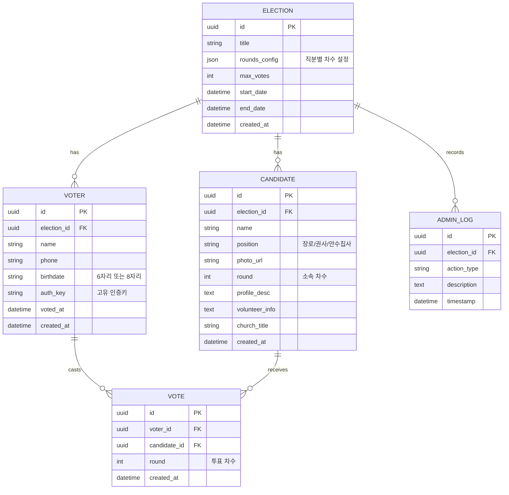

# RDBMS 리팩토링 계획 (Firebase NoSQL -> Relational DB)

현재 프로젝트의 Firebase(NoSQL) 구조를 분석하고, 이를 RDBMS(예: PostgreSQL, MySQL)로 리팩토링하기 위한 설계 및 전략입니다.

## 1. 현재 구조 분석 (Firebase)
- **elections**: 선거 마스터 정보 (id, title, rounds, settings 등)
- **voters**: 선거인 명부 (electionId 하위 컬렉션, name, phone, birthdate, authKey, hasVoted 등)
- **candidates**: 후보자 명부 (electionId 하위 컬렉션, name, position, photoUrl, profileDesc, voteCount 등)
- **adminLogs**: 관리자 활동 로그 (actionType, description, timestamp 등)

## 2. RDBMS 스키마 설계 (Proposed Schema)

## 3. 리팩토링 및 마이그레이션 전략

### Step 1: ORM 및 DB 설정
- **Prisma** 또는 **Kysely**를 사용하여 스키마 정의 및 선언적 관리를 수행합니다.
- Vercel Postgres 또는 로컬 데이터베이스 환경을 구축합니다.

### Step 2: API 계층 수정 (Data Layer Abstraction)
- `lib/firebase.ts`를 대체하는 `lib/db.ts` (혹은 `lib/prisma.ts`)를 구현합니다.
- 클라이언트의 `getDocs`, `addDoc` 호출을 Server Actions 또는 API Routes를 통한 DB 쿼리로 변경합니다.

### Step 3: 데이터 마이그레이션 (One-time Migration Script)
1. Firebase Admin SDK를 사용하여 전체 데이터를 JSON으로 추출합니다.
2. 매핑 로직을 통해 추출된 데이터를 관계형 모델에 맞게 변환합니다.
3. RDBMS에 대량 삽입(Bulk Insert)을 수행합니다.

### Step 4: 성능 및 정규화 이점
- **중복 제거**: NoSQL에서 필요했던 중복 데이터들을 외래 키(FK) 참조로 정규화합니다.
- **트랜잭션**: 투표 처리 시 `VOTER` 상테 업데이트와 `VOTE` 기록을 원자적으로 처리하여 무결성을 보장합니다.

## 4. 기대 효과
- **데이터 일관성**: 외래 키 제약 조건을 통해 잘못된 데이터 참조 방지.
- **쿼리 유연성**: 복잡한 통계(예: 차수별/직분별 득표 집계)를 SQL로 훨씬 효율적으로 수행 가능.
- **확장성**: 추후 복잡한 관계(예: 교구별 통계 등) 추가 시 유지보수 용이.
